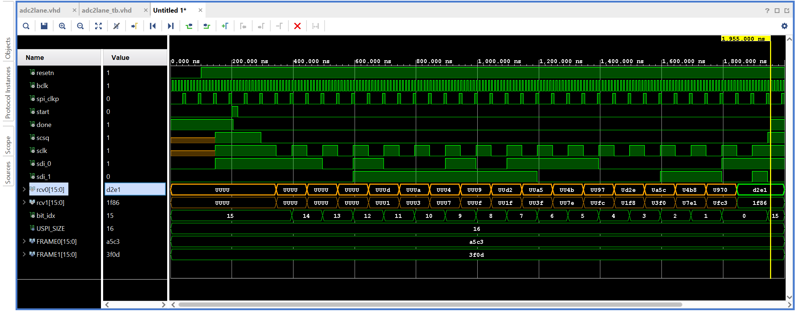
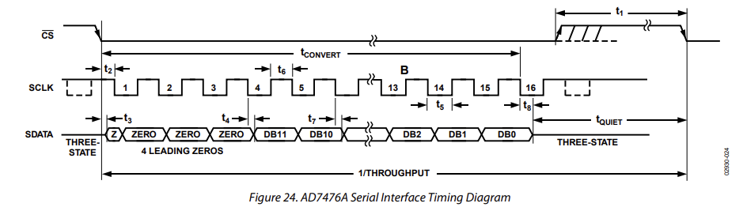

# 🚀 Dual‑Lane SPI ADC Controller (AD7476A) — FPGA IP Core

A **production‑ready, simulation‑verified FPGA IP core** for fast and reliable data acquisition using **dual AD7476A ADCs** (e.g., **Digilent PmodAD1**).  
Designed with **clean FSM architecture**, **datasheet‑accurate SPI timing**, and **easy system integration** in mind.

> Built for portfolios, coursework, and real‑world FPGA data‑acquisition pipelines.

---

## ✨ Why This IP Stands Out

- ⚡ **Two ADC channels captured in parallel** (true dual‑lane SPI)
- 🔁 **SPI Mode 1 (CPOL = 0, CPHA = 1)** — matches AD7476A datasheet exactly
- 🧠 **FSM‑driven design** (no gated clocks, no race conditions)
- ⏱ **Clock‑enable based SPI timing** (`spi_clkp`) — FPGA best practice
- 🧪 **Self‑checking simulation** with realistic ADC behavior
- 🧩 Drop‑in component for **Zynq, MicroBlaze, or custom FSMs**

---

## 📷 Visual Timing Overview

### SPI Mode & Sampling Strategy


### AD7476A Datasheet-Accurate Timing


These diagrams directly reflect the **implemented logic** and the **verified simulation waveforms**.

---

## 🎯 Target Hardware

- **ADC**: Analog Devices **AD7476A**
- **Resolution**: 12‑bit
- **Interface**: SPI‑compatible serial interface
- **Clocking**: 16 SCLK cycles per conversion
- **Reference Board**: **Digilent PmodAD1** (2× AD7476A in parallel)

---

## 🧠 Architecture at a Glance

### 1️⃣ Control FSM
- Clean `start` / `done` handshake
- Guarantees **single‑shot conversions**
- Prevents re‑triggering while SPI is active

### 2️⃣ SPI Engine FSM
- Generates `CS` and `SCLK`
- Samples **two SDATA lines simultaneously**
- Advances only on a **clock‑enable pulse** (`spi_clkp`)

✔ Glitch‑free outputs  
✔ Deterministic timing  
✔ Synthesis‑friendly

---

## 📊 Data Format (16‑bit SPI Frame)

Each conversion returns a 16‑bit word per channel:

```
[15:12]  Leading zeros
[11:0]   Valid ADC result (MSB first)
```

### Correct extraction of 12‑bit ADC data

```vhdl
adc0_12bit <= rcvData_0(11 downto 0);
adc1_12bit <= rcvData_1(11 downto 0);
```

---

## 🔌 Integration‑Friendly Interface

```text
start   → trigger one conversion
 done   ← conversion complete
 scsq   → SPI chip‑select (active LOW)
 sclk   → SPI clock
 sdi_0  → ADC channel 0
 sdi_1  → ADC channel 1
```

This IP can be driven by:
- a soft or hard CPU
- a higher‑level FSM
- AXI‑Lite control logic
- DMA or streaming pipelines

---

## 🧪 Verification & Quality

- ✔ Self‑checking VHDL testbench
- ✔ Datasheet‑accurate SPI timing
- ✔ Verified bit alignment
- ✔ Clean Vivado simulation waveforms
- ✔ Hardware‑ready (ILA‑friendly)

---

## 📁 Repository Layout

```
adc2lane_vhdl/
├─ src/        # Synthesizable VHDL
├─ sim/        # Self‑checking testbench
├─ docs/       # Timing diagrams & documentation
└─ README.md
```

---

## 💼 Portfolio Value

This project demonstrates:

- Strong understanding of **SPI protocols**
- **Datasheet‑driven digital design**
- FPGA‑safe clocking techniques
- Verification‑first mindset
- Clear, professional documentation

👉 Ideal as a **portfolio project** for:
- FPGA Engineer
- Embedded Systems Engineer
- Digital Design / Hardware Engineer roles

---

## 📜 License

Educational and research use. Reuse with attribution welcome.

